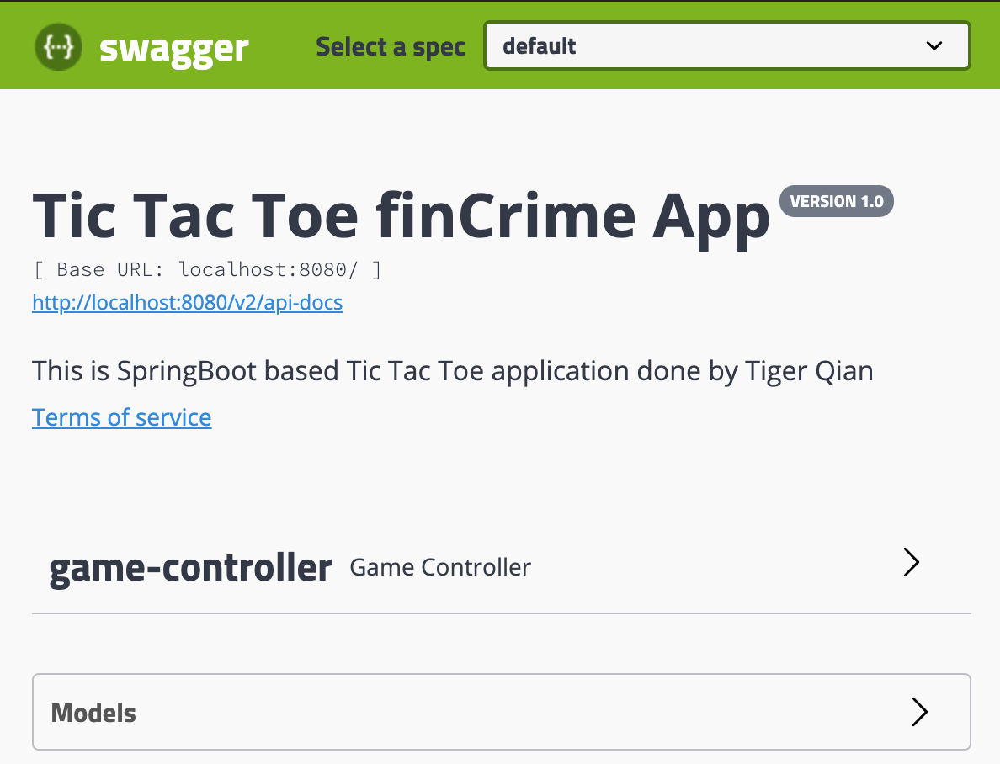
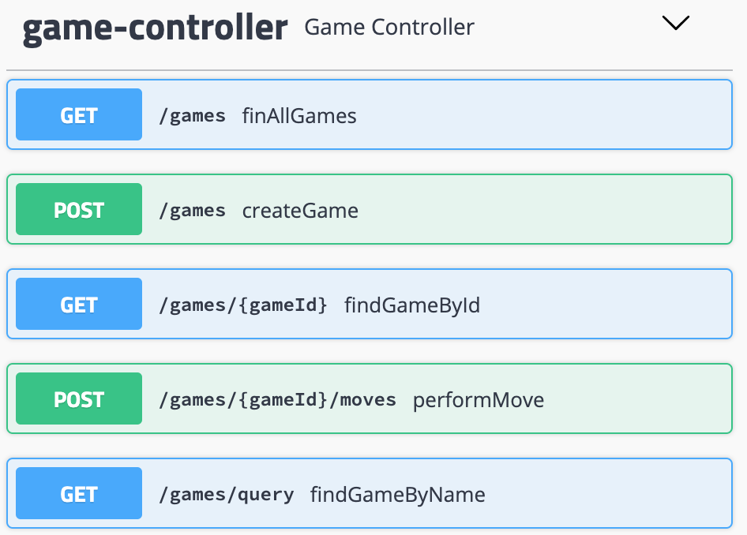
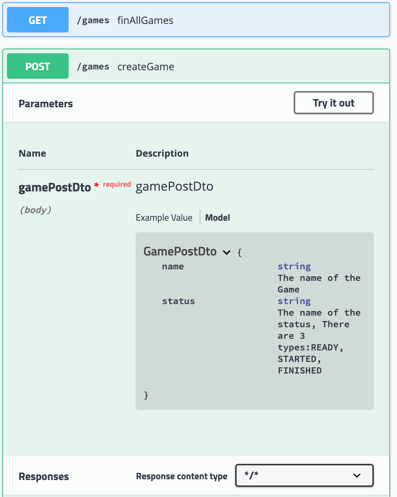
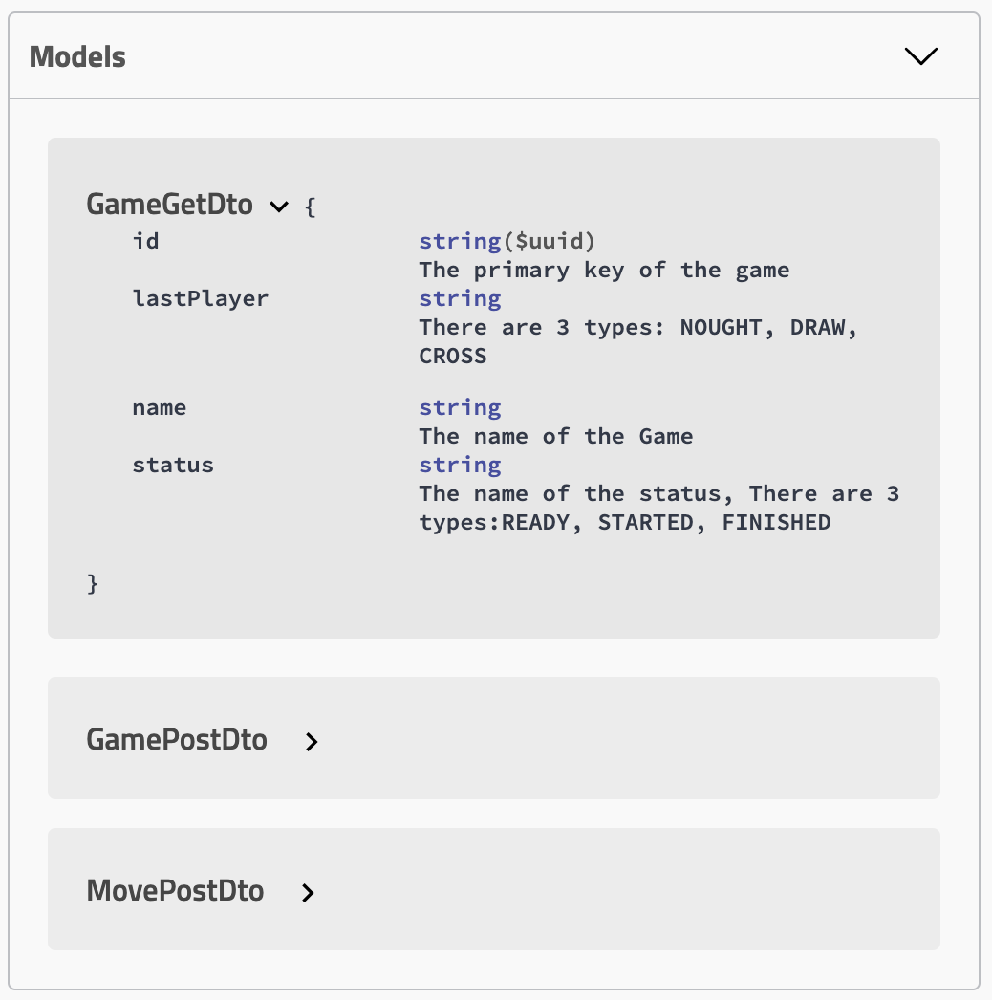

# Tic Tac Toe application
## Tech Stack:
* SpringBoot
* Docker
* MySQL
* Lombok
* Mapstruct
* Spring Data JPA
* H2 in-memory DB
* Mockito
* MockMvc
* Swagger

## Topics
1. [How to run this application](#How-to-run-this-application)
2. [How to access the spring boot restful application](#How-to-access-the-spring-boot-restful-application)
3. [MySQL version based Tic Tac Toe Application](#MySQL-version-based-Tic-Tac-Toe-Application)
4. [Advantages of this application](#Advantages-of-this-application)

### This is the springBoot based RESTful API. It supports the below functions:

* Create a new game
* List all games
* Find a game via id
* Find a game via game name
* Perform a move in a game & determine the status of a game & return the winner if there is one

## How to run this application

* Navigate the the root folder /tictactoe under the command line
* run the command to build the whole project: **gradle clean build**
* run the command to start the application: **java -jar ./build/libs/tictactoe-0.0.1-SNAPSHOT.jar**

## How to access the spring boot restful application
### You may access swagger doc by accessing below url once application is up and running
http://localhost:8080/swagger-ui.html

#### This is swagger summary screenshot

#### When you expend game controller, there are all the controller list displayed as below:

#### When clicking any endpoint, for instance createGame, it will show the details and you can hit it to get the response. Just like the below screenshot.

#### There is the modal automatically generated by swagger. You may check the detail if you click one of them. the detail of it will be shown as the below screenshot.

## MySQL version based Tic Tac Toe Application
### I also prepared MySQL version. Please follow below steps if you want to try MySQL version
* Navigate the the root folder /tictactoe under the command line
* rename **application.properties** to another name e.g. **application_backup.properties**
* rename **application-mysql.properties** to **application.properties**
* run command to **docker-compose up**
* run the below gradle command to build the whole project: **gradle clean build**
* when the above step is done, run the command **java -jar ./build/libs/tictactoe-0.0.1-SNAPSHOT.jar**

## Advantages of this application
* Hibernate builds the entity layer to connect MySQL database server
* Spring Data JPA builds the repository layer (DAO) & H2 in-mem database used as Unit Test to test this layer
* Mapstruct used to map data between entities and dtos
* All the exceptions can be centrally handled in one place (ControllerExceptionHandler.java)
* Lombok makes our life easierIt automatically generates getter,setter, constructor, hashcode, log etc.

